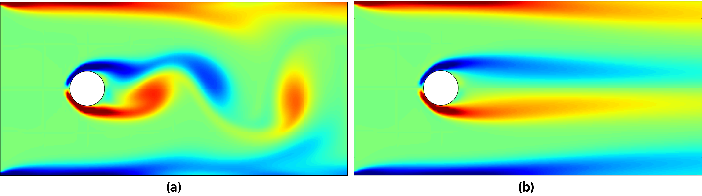
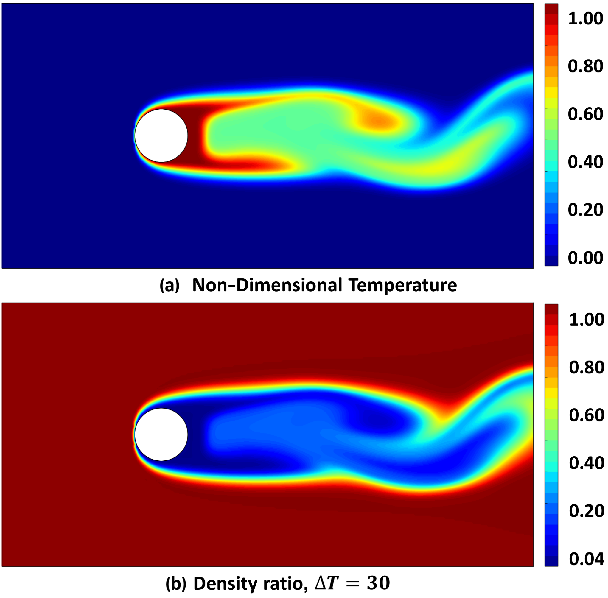
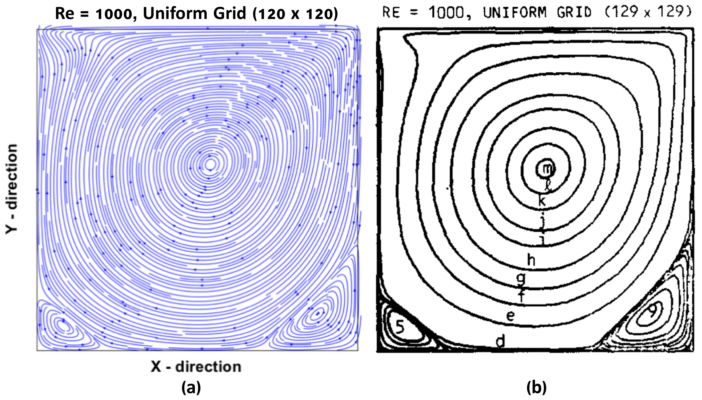
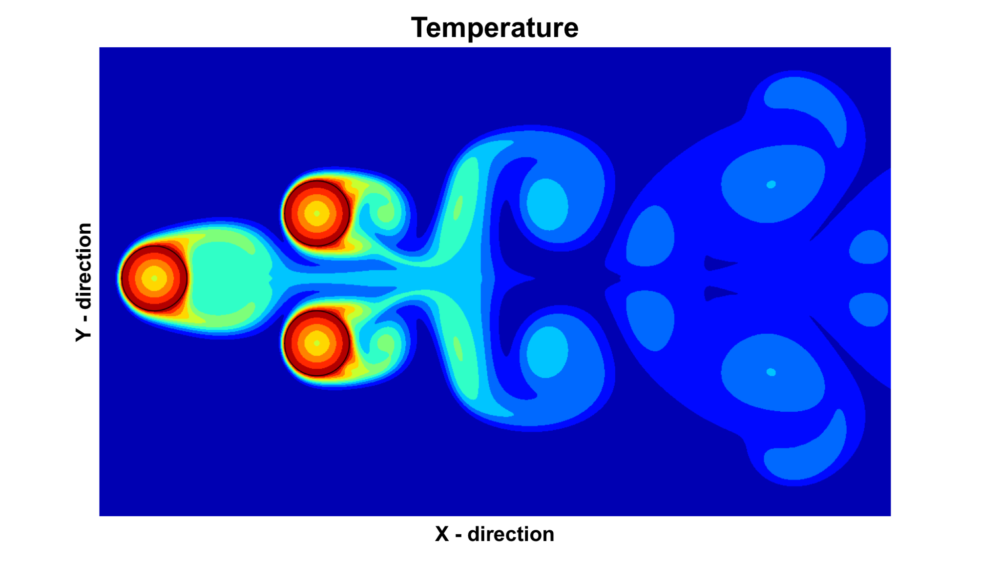
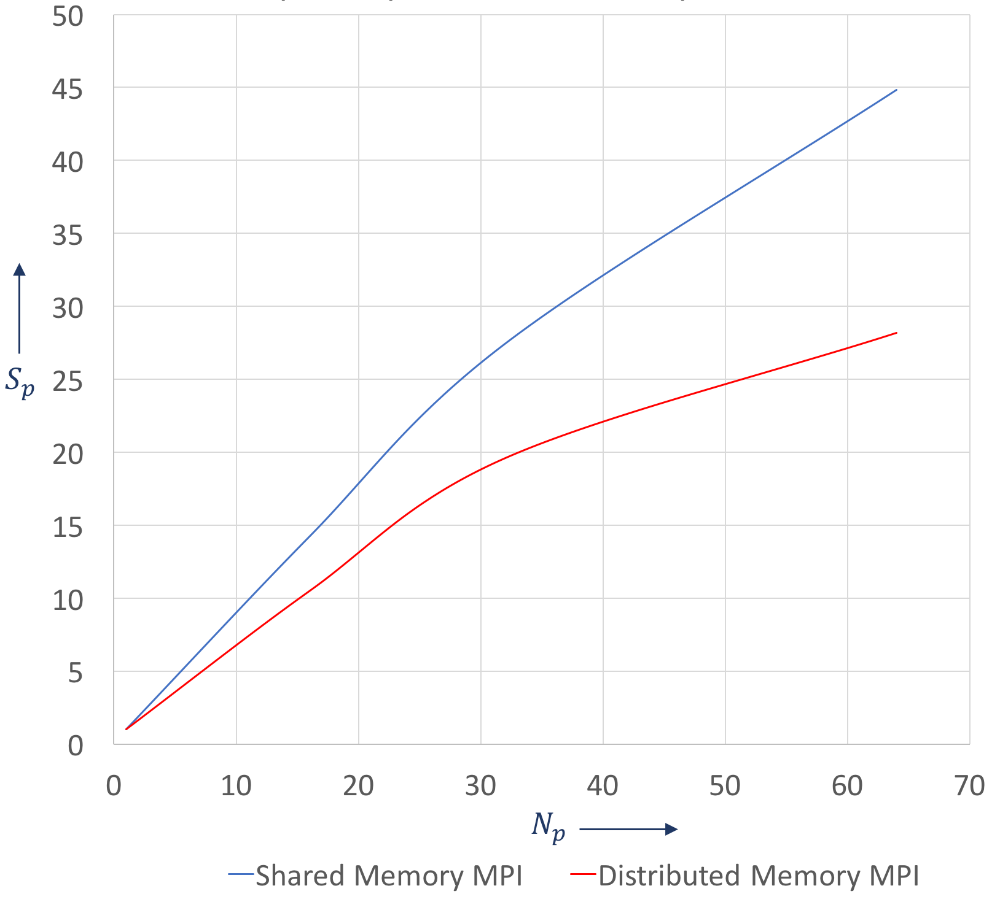

<h2> PARA-PHYSICS, A parallel block structured computational multi-physics solver </h2> 

<h3> Important Information </h3>

<ol>
	<li>This is version 2.0 of the software, previous versions can be found in the old releases</li>
	<li>The software can solve Incompressible Navier-Stokes and Heat advection diffusion equations for both singlephase and multiphase problems</li>
	<li>Immersed boundary method is implemented to compute flow over solid bodies</li>
	<li>Progress is underway to add new physics modules</li>

<h3> Parallelization Options </h3>

<ol>
	<li>Standard MPI distributed memory model
	<li>MPI Remote Memory Access (RMA) model
	<li>MPI Shared Memory (SHM) model
	<li>Hyper-threading using OpenMP
</ol>

<h3> Cache Optimization Features </h3>

<ol>
	<li>Loop tiling for linear algebra solvers
	<li>Array padding for spatial data
	<li>Blocked data storage for stencil computations
</ol>

<h3> Compilation and Execution Instructions </h3>

<ol>
	<li>Download the source code
	<li>Make sure you have make utility and the latest version of GNU and MPI-3 or higher installed
	<li>Edit the Makefile in ./src to include your MPI path
</ol>

        src
        make
        cp Solver ../working/.
        cd ../working
        mpirun -n [number_of_procs] ./Solver
        

<ol start="4">
	<li>You can also optimize Poisson solver and heat equation by hyper-threading using OpenMP on each core. The number of threads are specified 
     in Solver.h
   <li>To plot results, edit the python file (plot.py) to match your grid size and simply type (make sure k = nblockx and d = nblocky)
</ol>

        python plot.py

<h2> Examples </h2>

<h3> 1. Vortex suppression through conjugate heat transfer </h3>

 Formation of von Kármán vortices behind bluff and aerodynamic bodies in a fluid flow generate structural vibrations which, especially at high Reynolds number can lead to disastrous consequences. These counter-rotating vortices are not uncommon and can easily form around objects like buildings, powerplant equipments, aircrafts, ships and submarines. The magnitude of damages is directly proportional to the frequency of vortex release which increases with the flow speed.

  

<b>

Figure 1. Vorticity contours around a cylinder in channel flow, t = 50 units and Re = 1000 (Red-CCW, Blue-CW) (Block grid size - 20 x 20) (Num blocks - 16 x 8)

</b>

  

<b>

Figure 2. Fluid properties during conjugate heat transfer for Re = 1000

</b>

 From an engineering perspective, it is important to study the effect of their behavior during design stages and find a way to mitigate them. One way is to suppress the frequency of vortex release through conjugate heat transfer from the body itself. For example, consider a two-dimensional case of a solid cylinder placed inside a channel flow at Re = 1000. <b>Fig 1(a)</b> shows the vorticity contours with clock-wise and counter clock-wise behavior. Now, when the surface of this cylinder starts to heat up we see that these counter-rotating vortices begin to dissipate as shown in <b>Fig 1 (b) & (c)</b> . The vortex release frequency reduces with increase in temperature and at higher temperatures the von Kármán vortices completely disappear as in <b>Fig 1 (d)</b>. 

 This behavior can be explained by observing the temperature and density distribution inside the fluid. <b>Fig 2</b> shows contoured distribution of these properties for one such case. As temperature inside the fluid increases it undergoes thermal expansion which leads to a decrease in density, this causes a reduction in local Reynolds number thus suppressing the vortex formation in the wake region. 

<h3> 2. Lid Driven Cavity </h3>

  

<b>

Figure 3. (a) Numerical solution, (Block grid size - 20 x 20) (Num blocks - 6 x 6) (b) Reference solution by <a href="https://pdfs.semanticscholar.org/211b/45b6a06336a72ca064a6e59b14ebc520211c.pdf"> Ghia .et .al </a>

</b>

 Lid driven cavity is a traditional benchmark problem where the top wall is free slip and moves at a speed <i>U</i> and the remaining three walls are no slip. These conditions leading to interesting vortex patterns which depend on the Reynolds number. It is used here to validate the numerical results with reference data.

<h3> 3. Conjugate heat transfer between fluid and multiple immersed boundaries </h3>

 This example is to show the capability of software in handling multiple immersed boundaries. The test case here shows temperature distributed inside the fluid due to the presence of three heated cylinders. 

  

<b>

Figure 4. Conjugate heat transfer between air and three solid cylinders, Re = 500, t = 25 units, (Block grid size - 20 x 20) (Num blocks - 40 x 40) 

</b>

 This type of situation are typically found in heat-exchangers and nuclear reactors and can be further understood using simulation tools. 

<h3> 4. MPI shared memory vs distributed memory model </h3>

  

<b>

Figure 5. Speed up comparison on a 64 core Xeon Phi KNL processor 

</b>

 The new MPI-3 library enables use of shared memory parallelization for processes on the same node. Whether you are running simulation on a multi-node cluster or a single MIC (Many Integrated Cores) processor you can use shared memory intra-node and distributed memory inter-node. Experimental tests for this software show that MPI shared memory parallelization gives almost twice as much speed up in comparison to traditional distributed memory model. 

<h2></h2>
<h3> Author - Akash V. Dhruv </h3>
<h3> License - Refer LICENSE.md </h3>
<h3> Cite as - Akash Dhruv. (2017, June 21). akidhruv/Para-Physics: Para-Physics. Zenodo. http://doi.org/10.5281/zenodo.815018 </h3>
