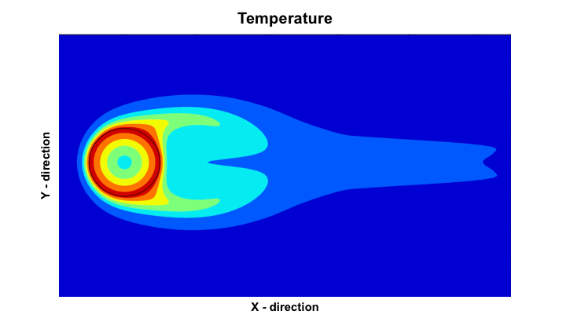
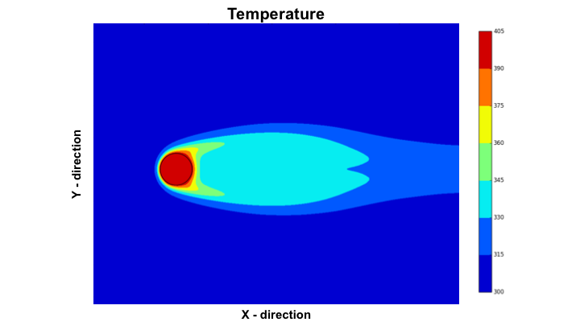
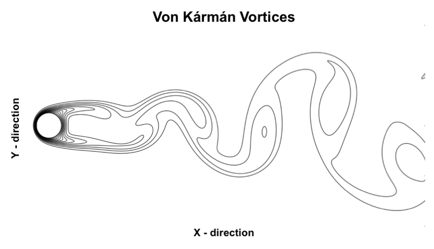
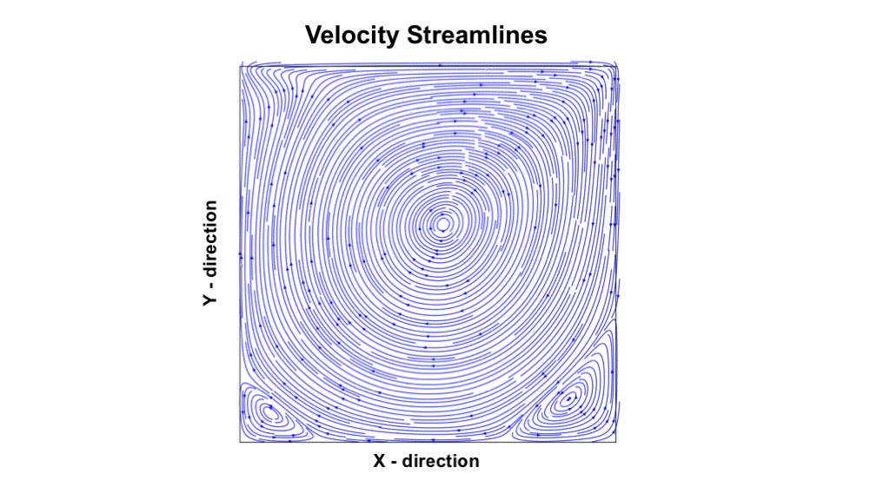
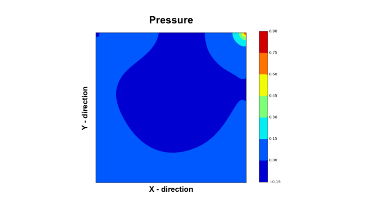
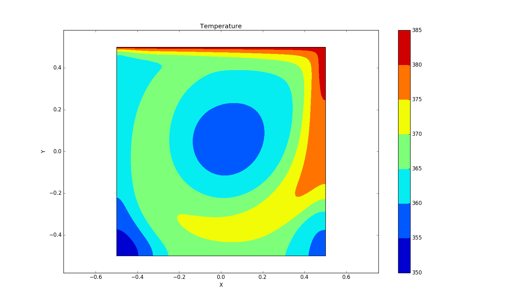

## Fortran based Hybrid MPI-OpenMP, Block Structured Computational Multi-Physics Solver 

### Important Information

  1. This is the latest version of ParaSolve, for previous versions look at other ParaSolve repositories.
  2. Single phase Heat Equation, Navier Stokes and Poisson Solver modules are working.
  3. Immersed boundary module is working.
  4. Conjugate Heat Transfer is in beta.
  5. AMR module not yet implemented.
  6. Multiphase module is in beta.

### Execution instructions

  1. Download the source code 
  2. Make sure you have make utility and the latest version of GNU and MPI installed
  3. Edit the Makefile to include your MPI path.

     ~~~terminal 
        make
        mpirun -n [number_of_procs] ./Solver 
     ~~~

  4. Note that the total number of MPI processes must be equal to the total number of blocks (nblockx X nblocky) defined in Solver.h

  5. You can also optimize Poisson solver by multi-threading using OpenMP on each MPI process. The number of threads are specified 
     in Solver.h

  6. To plot results, edit the python file (plot.py) to match your grid size and simply type (make sure k = nblockx and d = nblocky)

     ~~~terminal
        python plot.py
     ~~~ 

### Software outline

  1. The header file Solver.h handles simulation parameters like number of grid points per block, total number of blocks, module on/off, etc.

  2. The main program file is Solver.F90, which calls the functions Solver_init, Solver_evolve and Solver_finalize, which in turn calls
     module specific subroutines (module_init, module_solver, module_finalize).

  3. The best way to understand the code is to start with Solver.F90 and follow function calls one by one.

  4. All Grid data is stored in separate multi-dimensional arrays for cell-centers and faces located in the module, physicaldata.F90

  5. Module specific data is stored in files named module_data.F90. The interface for a given module, module_interface.F90 contains function
     definitions.

### Solver capabilities

#### CASE 1 - Air flow ovear a solid cylinder with Conjugate Heat Transfer (CHT), Re = 500
##### (Grid - 800 x 400) (4 x 4 MPI processes) (2 OpenMP threads per process)

  

  Figure 1. Conjugate Heat Transfer between solid cylinder and air, Re=500, t=10.0 s. 

  
  

  Figure 2. Velocity Streamlines and Temperature Contours, Re = 500, t = 30.0 s. 

  
  

  Figure 3. Vorticity Contours, Re = 500, t=60.0 s

#### CASE 2 - Lid Driven Cavity Flow, Re = 1000
##### (Grid - 100 x 80) (2 x 2 MPI processes) (4 OpenMP threads per process)

  
  
  

  Figure 4. Velocity Streamlines and Pressure and Temperature Contours for Lid Driven Cavity flow, Re = 1000.

### Author - Akash V. Dhruv  
### License - Refer LICENSE.md
